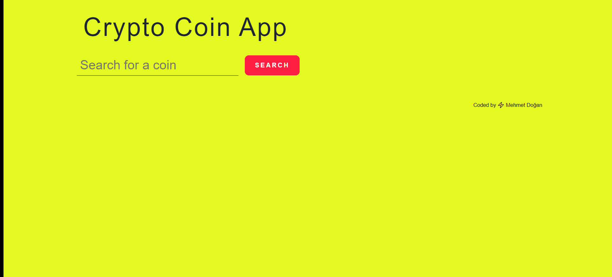
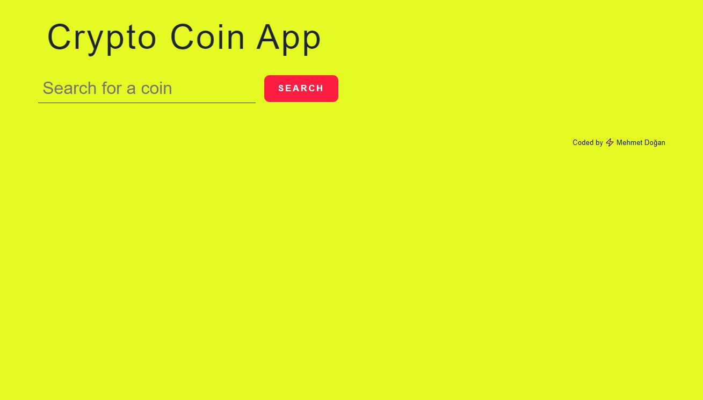
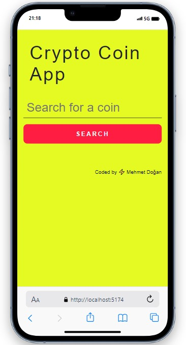
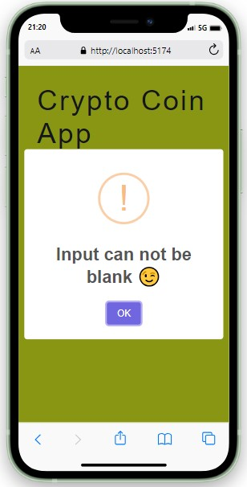
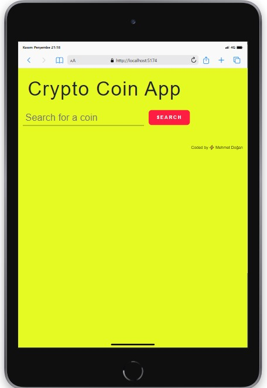
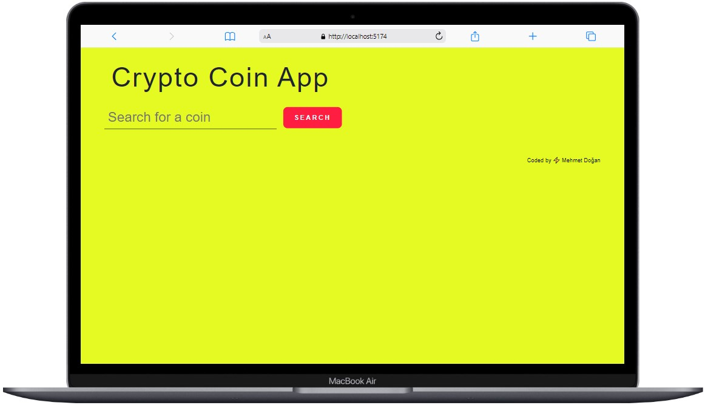

# 
# Coin App
<table >
<tr>
<td>
  A Crypto App using Coinranking API to display crpyto currencies on list. Can be filter on search area what you want find. Follow the changes fast with this App easily.
</td>
</tr>
</table>

## Demo
Here is a working live demo : [LIVE](https://coin-app-coin.netlify.app/) 
## Mobile support
The WebApp is compatible with devices of all sizes and all OS's, and consistent improvements are being made.

### Development
Want to contribute? Great!

To fix a bug or enhance an existing module, follow these steps:

- Fork the repo
- Create a new branch (`git checkout -b improve-feature`)
- Make the appropriate changes in the files
- Add changes to reflect the changes made
- Commit your changes (`git commit -am 'Improve feature'`)
- Push to the branch (`git push origin improve-feature`)
- Create a Pull Request 

## Built with 

- [Coinranking API](https://developers.coinranking.com/api/documentation) - Free , Real-time prices , Rich metadata
- [Bootstrap](http://getbootstrap.com/) - Extensive list of components and  Bundled Javascript plugins.